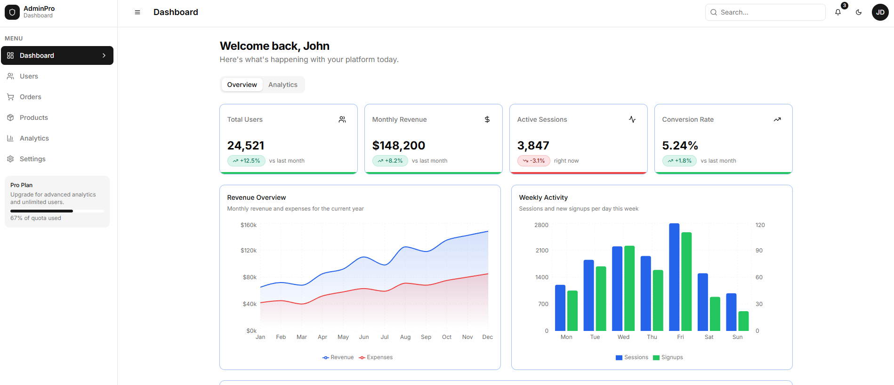
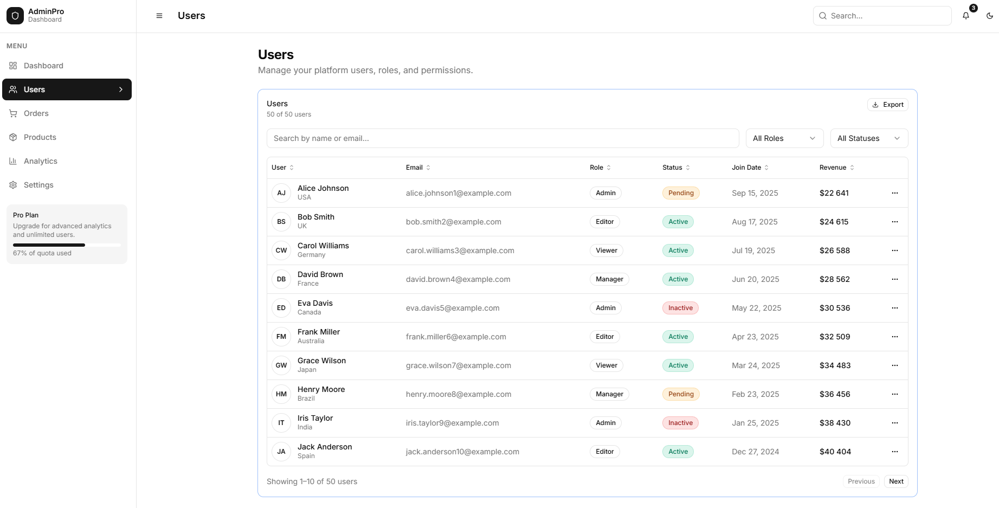
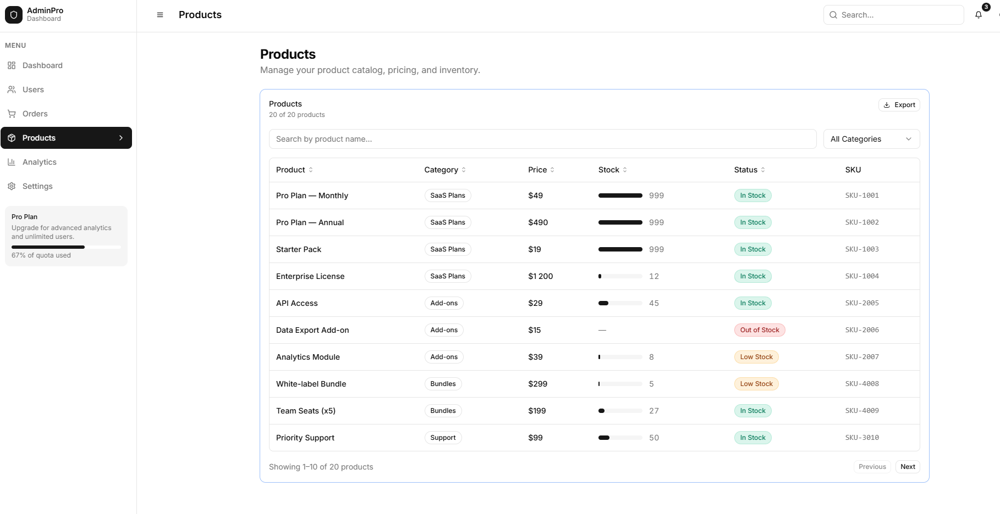
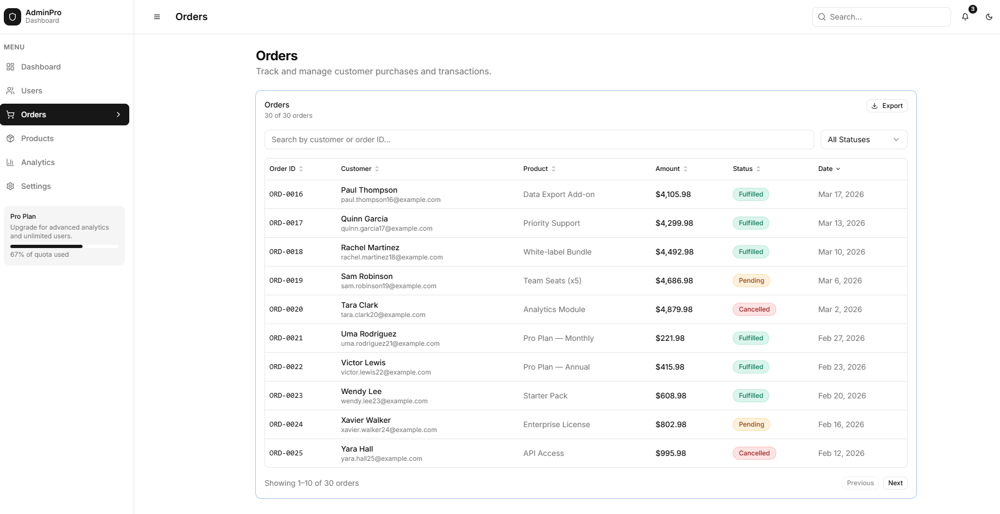
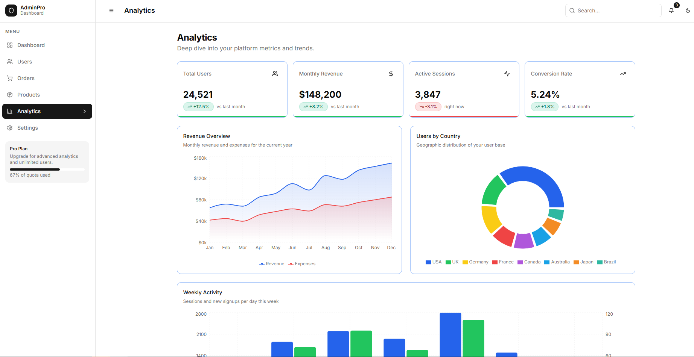

# Admin Dashboard

Admin dashboard built with **Vite + React + TypeScript**, styled with **Tailwind CSS** and **Radix UI / shadcn** components. Data is mocked in development via **MSW**, and server state is handled with **TanStack Query**.

## Tech stack

- React 18, TypeScript
- Vite 5
- Tailwind CSS
- Radix UI primitives + shadcn-style components
- TanStack React Query (+ Devtools)
- MSW (Mock Service Worker) in dev
- Recharts

## Screenshots







## Getting started

Install dependencies:

```bash
npm install
```

Run the dev server:

```bash
npm run dev
```

Build for production:

```bash
npm run build
```

Preview the production build:

```bash
npm run preview
```

## Project structure

- `src/pages/` — route pages
- `src/components/` — feature components (tables, charts, layout)
- `src/components/ui/` — reusable UI primitives
- `src/api/` — API wrappers used by React Query (backed by MSW in dev)
- `src/mocks/` — MSW setup + in-memory mock database
- `src/hooks/` — shared hooks (e.g. debounced value)

## Mock API (dev)

In development, MSW is started in `src/main.tsx` and intercepts requests to `/api/*`.

